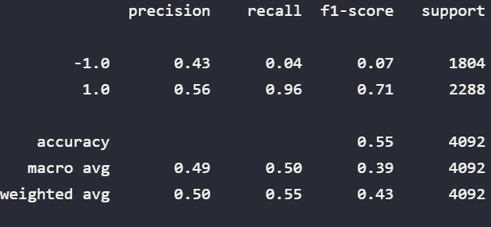
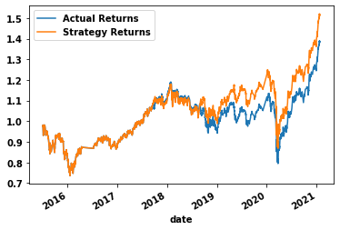
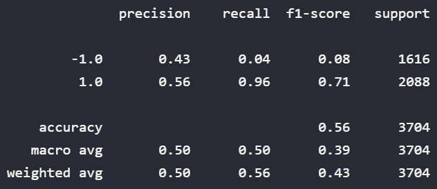
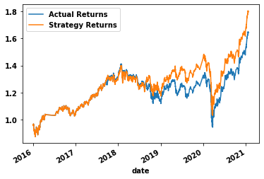
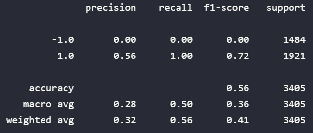
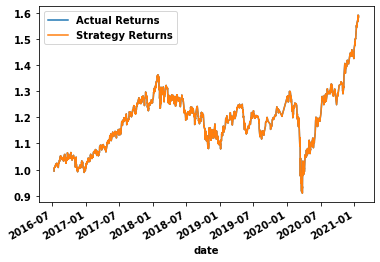
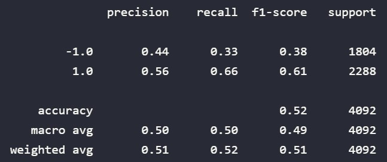
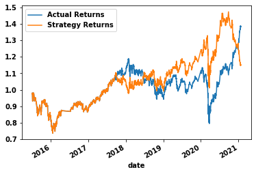

# Algorithmic Trading Challenge
---

## Establish a Baseline Performance

First we used an SVM model. You can see a snip of the classification report here.



When looking at the classification report, we can see that the precision for the `-1` class is `0.43` and for the `1` class it is `0.56`. The recall is `0.041` for the `-1` class and `0.96` for the `1` class. Based on the higher recall, it seems that the model is much better at predicting the `1` class than the `-1` class. The accuracy is not too great at `0.55`.

Below shows an overlay plot comparing the actual returns to those that the SVM model predicted. 



We can see that the SVM model performed very well at the beginning of the data, but we start to see difference starting in 2019 where the lines start separating.

---

## Tune the Baseline Trading Algorithm

In attempt to tune the algorithm, I first used a different ```DateOffSet``` value of 6 months. We can see the updated classification report here. 



As we can see, nothing really changed in terms of precision or recall but the accuracy went up one-hundredths of a point. We can then look at the plot. 



Nothing significant changed about the plot either except that it started 6 months later. 

The next attempt to tune the algorithm, I kept the 6 month offset, but I also changed the short window from 4 to 10 and the long window from 100 to 200. The new classification report is below. 



As you can see, the precision and recall for the `-1` class dropped to zero. Because of this in the overlay plot of this data (seen below), the returns are identical. But because of the classification report we can see it's because the model could not do anything for the `-1` class, so it's still not very helpful. 



---

## Evaluate a New Machine Learning Classifier

In this section, I tested the `Logistic Regression ` classifier to see if it would perform any differently. Unfortunately I was out of luck. You can see the Logistic Regression Classification report below. 



The precision and recall changed a little bit and the accuracy went down. We can also look at the plot of the Logistic Regression model. 



As we can see there is a lot more variation that also occurs starting in 2018 as opposed to 2019 with the SVM model.

---

## Conclusion

After comparing all the differentiations, the best model is the original SVM model. You could argue that the one that started 6 months later is a tad better due to the accuracy score, but it is an insignificant change. 